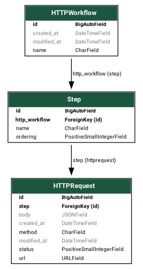
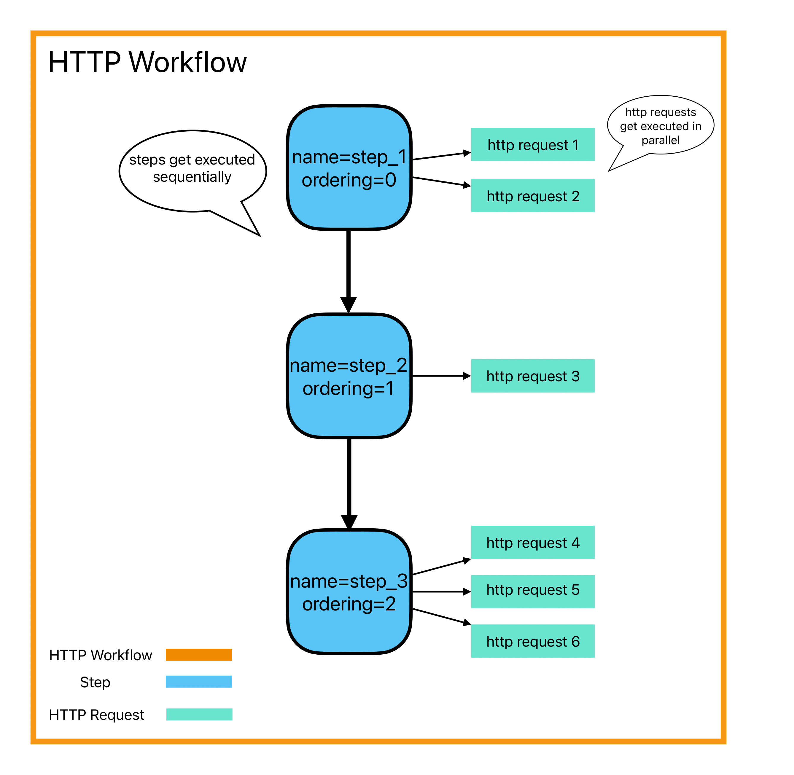

# Workflow

**Description:**
The Workflow project is designed to facilitate the creation and execution of workflows that involve sending HTTP requests. Workflows can be structured to dispatch related HTTP requests sequentially, in parallel, or a combination of both, offering flexibility in designing complex interactions with external services.

To execute workflows, two different methods have been implemented: Celery (using group and chain) and asyncio for handling concurrent operations.

## Relationships between models

For a comprehensive understanding of the project's data structure and relationships, 
please refer to the following image depicting the models' relationships:

## Execution visualization

To gain insights into how the HTTP workflow execution is visualized, 
refer to the diagram provided in the following image:

